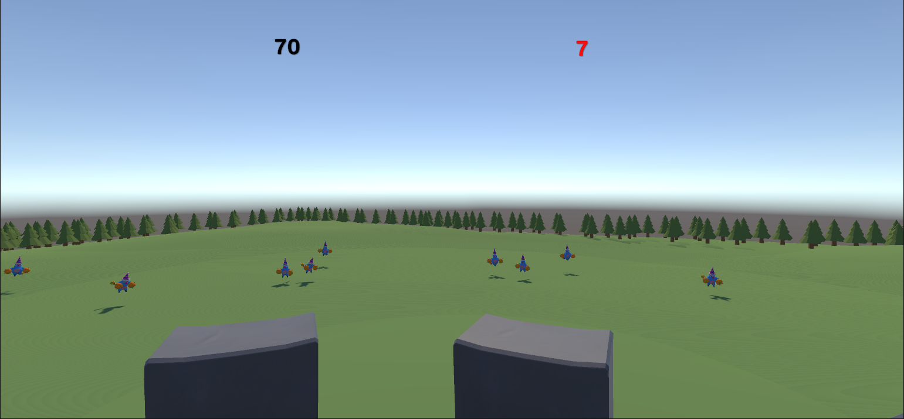
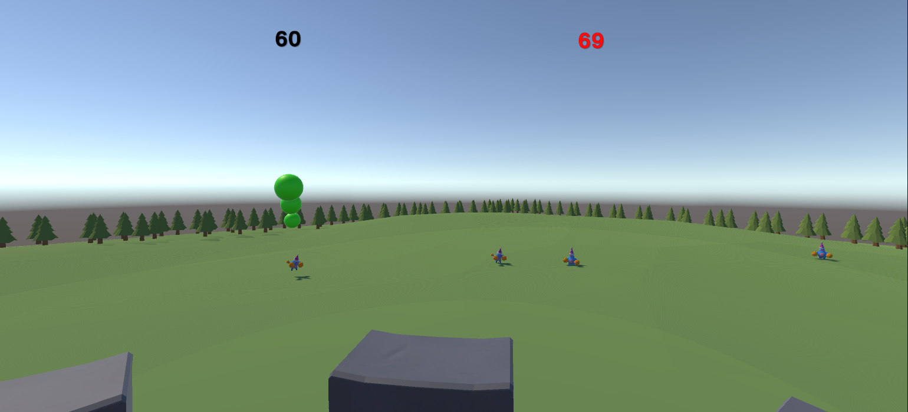

# Tower Defense - Defend the Fortress

Welcome to *Tower Defense*, a Unity-based game where you defend a fortress under attack from waves of enemies. Strategize, aim carefully, and protect the tower from incoming assaults. Can you survive all enemy waves?

---

## Table of Contents
- [Overview](#overview)
- [Gameplay](#gameplay)
- [Controls](#controls)
- [Game Mechanics](#game-mechanics)
- [User Interface](#user-interface)
- [Victory and Defeat Conditions](#victory-and-defeat-conditions)
- [Audio](#audio)
- [Cheat Codes](#cheat-codes)
- [Installation](#installation)
- [Assets](#assets)

---

### Overview
In *Tower Defense*, you are the last line of defense for a fortress tower located in the center of a vast plain. As enemies approach from all directions, it’s up to you to eliminate them before they bring down the tower. The game features waves of enemies, limited tower energy, and engaging mechanics to keep players on their toes.

---

### Gameplay
In *Tower Defense*, players must defend a stationary fortress at position (0, 0, 0) on the map. Waves of enemies spawn from random angles around the tower and approach it, launching projectiles when they reach a certain distance. The player must click on enemies to attack them, using up tower energy with each shot.

### Controls
- **Camera Rotation**: `A` and `D` (or left and right arrow keys) to rotate the camera around the tower.
- **Attack Enemies**: Click on an enemy to launch a projectile toward it.

---

### Game Mechanics
#### Tower Mechanics
- **Health**: The tower starts with 100 health points. Each enemy projectile that hits reduces health by 1. If health reaches 0, the game is lost.
- **Energy**: The tower's energy regenerates at 10 points per second, with a maximum of 100. Launching projectiles reduces energy based on distance to the enemy.

#### Enemy Waves
- **Wave Structure**: There are 5 waves, each with 10 enemies.
- **Spawning**: Enemies spawn at a fixed distance from the tower with random angles and advance toward it.
- **Attack**: Enemies stop at a certain point and launch projectiles toward the tower every 2 seconds.

#### Projectiles
- **Enemy Projectiles**: Enemies fire projectiles toward the tower, causing damage on impact.
- **Tower Projectiles**: The tower fires projectiles when the player clicks on an enemy. Energy cost is higher for distant targets.

---

### User Interface
The game displays:
- **Tower Health** in red.
- **Tower Energy** in a visible color other than red.
- **Victory and Defeat Messages** with a button to restart the game when the game ends.

---

### Victory and Defeat Conditions
- **Victory**: Defeat all 50 enemies across 5 waves to win. A victory message appears with an option to restart the game.
- **Defeat**: If the tower’s health reaches 0, the game is lost, and a defeat message is shown with an option to restart.

---

### Audio
- **Background Music**: An ambient soundtrack plays continuously in the background.
- **Projectile Sounds**: Different sounds play for enemy and tower projectiles.
- **Error Sound**: Plays when attempting to fire with insufficient energy.

### Cheat Codes
- **Disable Enemy Projectiles**: Press `P` to make enemy projectiles harmless.
- **Free Energy Cost for Tower Projectiles**: Press `O` to remove the energy cost for firing projectiles.

---

### Installation
1. Clone this repository.
2. Open the project in Unity (tested in Unity version X.X.X).
3. Import required assets from Unity’s Asset Store.
4. Build and run the game.

---

### Assets
The game includes assets from Unity’s Asset Store, including models for the tower, enemies, and projectiles. Please refer to each asset’s individual license for usage terms.

---

Good luck defending the fortress!
